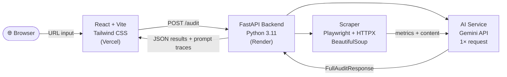

<p align="center">
  
</p>

<h1 align="center">InsightScrape</h1>

<p align="center">
  AI-powered website audit tool that extracts real page metrics and delivers data-grounded SEO, content, and UX insights.
</p>

<p align="center">
  
  
  
  
  
  
  
</p>

<p align="center">
  <a href="#quick-start">Quick Start</a> ·
  <a href="#features">Features</a> ·
  <a href="#architecture">Architecture</a> ·
  <a href="#ai-design-decisions">AI Design</a> ·
  <a href="#trade-offs">Trade-offs</a> ·
  <a href="#what-id-improve-with-more-time">Improvements</a> ·
  <a href="#running-tests">Tests</a>
</p>

---

## Quick Start

> **Prerequisites:** Python 3.11+, Node.js 18+, and a free [Gemini API key](https://aistudio.google.com/apikey)

```bash
git clone https://github.com/MadhushanAndawaththa/InsightScrape.git
cd InsightScrape
```

**Backend**
```bash
cd backend
python -m venv venv && venv\Scripts\activate   # Windows
pip install -r requirements.txt
playwright install chromium
cp .env.example .env   # then set GEMINI_API_KEY=your_key_here
python main.py         # → http://localhost:8000
```

**Frontend**
```bash
cd frontend
npm install
npm run dev            # → http://localhost:5173
```

Open **http://localhost:5173** — enter any URL and hit Audit.

---

## Features

| | Feature | Details |
|-|---------|---------|
| 🤖 | **Single-Pass AI Audit** | Analysis + recommendations in one Gemini API call using a combined structured schema |
| 🕷️ | **Dual Scraping** | Playwright (JS rendering) with HTTPX fallback for maximum site compatibility |
| 🎬 | **Rich Media Detection** | SVGs, `<video>`, YouTube/Vimeo embeds, `<canvas>`, CSS animations, Lottie, WebGL/3D |
| 🔍 | **Technical SEO Signals** | Viewport meta, canonical, Open Graph, Twitter Card, JSON-LD structured data |
| 🧠 | **Model Selection** | Choose between 4 Gemini models via the UI (Flash-Lite, Flash, 3.1 Flash Lite, 3 Flash) |
| 🛡️ | **Graceful Degradation** | If the AI fails, you still get all scraped metrics |
| 🔎 | **AI Transparency** | Expandable prompt logs show exact system/user prompts and raw responses |
| 📊 | **Deterministic Scoring** | Overall score computed server-side as a weighted average, not by the AI |
| 🔒 | **SSRF Protection** | Backend rejects localhost, 127.0.0.1, and private-range URLs |
| 🌗 | **Dark Mode** | Toggle with `localStorage` persistence |

---

## Architecture



**Request flow:**

1. **Fetch** — Playwright renders the page (full JS execution). Falls back to HTTPX if Playwright fails.
2. **Extract** — BeautifulSoup parses the HTML: headings, CTAs, images, alt text, links, meta tags, rich media (SVG/video/canvas/animations/3D), structured data, technical SEO signals.
3. **Analyze** — A single Gemini API call receives all metrics + up to 30K chars of visible text → returns structured analysis (5 categories × score + findings + evidence) AND 3–5 prioritized recommendations.
4. **Score** — The overall score is recomputed server-side as a deterministic weighted average (`structure×0.25 + messaging×0.20 + CTAs×0.20 + depth×0.20 + UX×0.15`).
5. **Respond** — Results, metrics, and full prompt traces are returned to the frontend.

### Tech Stack

| Layer | Technology |
|-------|-----------|
| **Backend** | Python 3.11 · FastAPI 0.135 · Pydantic 2.x · Uvicorn |
| **Scraping** | Playwright 1.58 · HTTPX · BeautifulSoup4 |
| **AI** | Google Gemini (2.5 Flash Lite · 2.5 Flash · 3.1 Flash Lite Preview · 3 Flash Preview) |
| **Frontend** | React 19 · TypeScript · Vite 8 · Tailwind CSS v4 |
| **Deployment** | Render (Docker) · Vercel |
| **Testing** | pytest · Vitest · React Testing Library |

### Why a Single AI Request?

Previously, the tool made 2 sequential API calls (analysis → recommendations). Since Gemini models support large context windows (1M+ tokens), both tasks fit in a single request using a combined `FullAuditResponse` Pydantic schema. This:

- **Halves the API request count** — critical when the free tier allows only 20 RPD
- **Improves recommendation coherence** — the model generates recommendations in the same context as its analysis, referencing the *exact* findings it just produced
- **Reduces latency** — one round-trip instead of two

The prompt uses XML-style tags (`<role>`, `<constraints>`, `<context>`, `<task>`) following Gemini's prompting best practices, and all prompts/responses are captured by a `PromptTracer` for full auditability.

---

## AI Design Decisions

| # | Decision | Rationale |
|---|----------|-----------|
| 1 | **Dual Scraping Strategy** | Playwright (headless Chromium) renders JS-heavy pages and bypasses bot protection. HTTPX is a fast fallback. |
| 2 | **Content Quality Awareness** | When thin content is detected, the system injects a `<data_quality_note>` into the prompt, instructing the AI to score conservatively rather than hallucinate quality. |
| 3 | **Deterministic Grounding** | The AI is explicitly prompted to anchor every claim to a factual metric (e.g., *"4 out of 5 images (80%) lack alt text"*). |
| 4 | **Structured Output via Pydantic** | `response_schema=FullAuditResponse` with `Field(description=...)` annotations. Gemini returns valid JSON — zero regex parsing. |
| 5 | **AI Transparency Layer** | Expandable prompt logs in the frontend show system prompt, user prompt, raw JSON response, and token usage for every run. |
| 6 | **Deterministic Overall Score** | Computed as a weighted average server-side, never by the AI. Ensures auditability and cross-run consistency. |
| 7 | **Rich Visual Media Detection** | Detects SVGs, CSS animations, Lottie, `<canvas>`, and WebGL/3D *before* DOM cleanup so nothing is missed. |
| 8 | **Technical SEO Extraction** | Viewport meta, canonical URLs, robots directives, Open Graph, Twitter Cards, and JSON-LD are all extracted and fed to the AI. |
| 9 | **Expert Prompt Engineering** | Agency-perspective role framing, a scored rubric (1–10), E-E-A-T signals, and meta-length analysis against ideal character ranges. |
| 10 | **Graceful AI Failure** | If the AI errors (rate limit, timeout), the tool still returns all scraped metrics — partial but useful results instead of a blank page. |

---

## Trade-offs

| Decision | Trade-off |
|----------|-----------|
| **Playwright** | Adds ~50 MB to install size, but is essential for JS-rendered sites. HTTPX is kept as a fast fallback. |
| **Single AI Request** | One large structured response vs. two focused calls. Slightly larger output schema, but halves API usage and improves coherence. |
| **CTA Heuristics** | Keyword matching + CSS class detection (`.btn`, `.cta`) + nav-aware filtering. Subjective by nature — a production system would use an ML classifier. |
| **No Database** | Prompt logs and audit history are ephemeral per request. Reduces deployment complexity but loses historical comparison. |
| **Free-Tier AI Models** | Limited to 20 RPD on most Gemini models. Single-request architecture mitigates this. |

---

## What I'd Improve With More Time

- **Multi-Page Crawling** — Crawl full sitemaps with Celery/Redis workers instead of single-page analysis.
- **Lighthouse Integration** — Blend AI insights with deterministic Core Web Vitals (LCP, CLS, INP) data.
- **Audit History & Diffing** — Store previous runs in Postgres and ask the AI to compare versions.
- **Response Caching** — Cache scrape+AI results by URL hash with a configurable TTL.
- **CTA ML Classifier** — Replace heuristics with a fine-tuned model for more accurate CTA detection.
- **Streaming AI Response** — Use Gemini's streaming API to show results progressively as they generate.
- **Competitor Benchmarking** — Audit multiple URLs and generate a comparative scorecard.

---

## API Reference

| Method | Endpoint | Status | Description |
|--------|----------|--------|-------------|
| `GET` | `/health` | `200` | Health check |
| `POST` | `/audit` | `200` | Run a full audit on a URL |

<details>
<summary>Request &amp; response examples</summary>

**POST `/audit`**
```json
// Request
{
  "url": "https://example.com",
  "model": "gemini-2.5-flash-lite"
}

// Response 200
{
  "url": "https://example.com",
  "metrics": {
    "word_count": 384,
    "cta_count": 25,
    "internal_links": 49,
    "external_links": 2,
    "total_images": 57,
    "images_missing_alt": 0
  },
  "analysis": {
    "overall_score": 7,
    "structure_score": 7,
    "messaging_score": 8,
    "cta_score": 9,
    "content_depth_score": 6,
    "ux_score": 8
  },
  "recommendations": [...],
  "prompt_logs": [...]
}
```

**Validation error — 422**
```json
{ "detail": [{ "loc": ["body", "url"], "msg": "URL must use http or https" }] }
```

**SSRF blocked — 400**
```json
{ "detail": "Requests to private/local addresses are not allowed" }
```
</details>

---

## Running Tests

### Backend (100+ tests)

```bash
cd backend
python -m pytest tests/ -v
```

<details>
<summary>Test coverage breakdown</summary>

- **Scraper** — CTA detection, metrics extraction, edge cases, binary content detection
- **Rich Media** — SVG counting, video/canvas/Lottie/WebGL detection, CSS animations
- **Technical SEO** — Viewport, canonical, OG, Twitter Card, JSON-LD, meta lengths
- **Models** — Pydantic validation, score ranges, serialization roundtrips, `FullAuditResponse`
- **AI Service** — Weighted score computation, prompt construction, content truncation
- **API Routes** — Health endpoint, input validation, SSRF protection
</details>

### Frontend (15 tests)

```bash
cd frontend
npm test
```

<details>
<summary>Test coverage breakdown</summary>

- **API Module** — Request construction, error handling, health check
- **AuditApp** — Rendering, dark mode toggle + persistence, form validation
</details>

---

## Project Structure

```
InsightScrape/
├── backend/
│   ├── main.py                    # FastAPI app entry point
│   ├── requirements.txt           # Python dependencies
│   ├── .env.example               # Template for environment variables
│   ├── Dockerfile                 # Docker deployment (Render)
│   ├── models.py                  # Pydantic schemas (PageMetrics, FullAuditResponse, etc.)
│   ├── routes/
│   │   └── audit.py               # POST /audit endpoint with SSRF protection
│   ├── services/
│   │   ├── ai_service.py          # Single-pass Gemini AI audit
│   │   ├── audit_orchestrator.py  # Orchestrates scrape → AI → response
│   │   ├── prompt_tracer.py       # Captures all prompts and responses
│   │   └── scraper.py             # Playwright/HTTPX scraping + metrics extraction
│   └── tests/                     # 100+ pytest tests
├── frontend/
│   ├── src/
│   │   ├── api/audit.ts           # API client and TypeScript types
│   │   ├── components/
│   │   │   └── AuditApp.tsx       # Main React component
│   │   └── test/                  # Vitest test files
│   ├── package.json
│   └── vite.config.ts
├── prompt_logs/
│   ├── example_audit_1.json       # Real audit log — gemini-2.5-flash-lite
│   └── example_audit_2.json       # Real audit log — gemini-2.5-flash
├── .gitignore
└── README.md
```

---

## License

MIT © 2026 Madhushan Andawaththa · Built as a 24-hour engineering assignment for [EIGHT25MEDIA](https://eight25media.com)